  

## 📌 About Me
- . . 26 Jahre
- . . . . Web Development
- . . . . . .App Development
- . . . . . . . . Software Engineering

## 📊 GitHub Stats & Trophies

  

## 🛠️ Languages & Tools

  

## 🔗 Connect with Me

   

<picture>
  <source media="(prefers-color-scheme: dark)" srcset="https://raw.githubusercontent.com/abozanona/abozanona/output/pacman-contribution-graph-dark.svg">
  <source media="(prefers-color-scheme: light)" srcset="https://raw.githubusercontent.com/abozanona/abozanona/output/pacman-contribution-graph.svg">
  
</picture>

